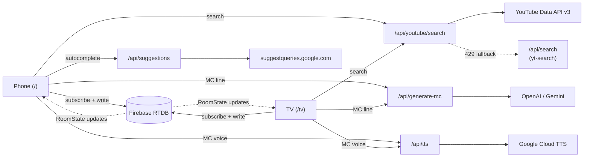
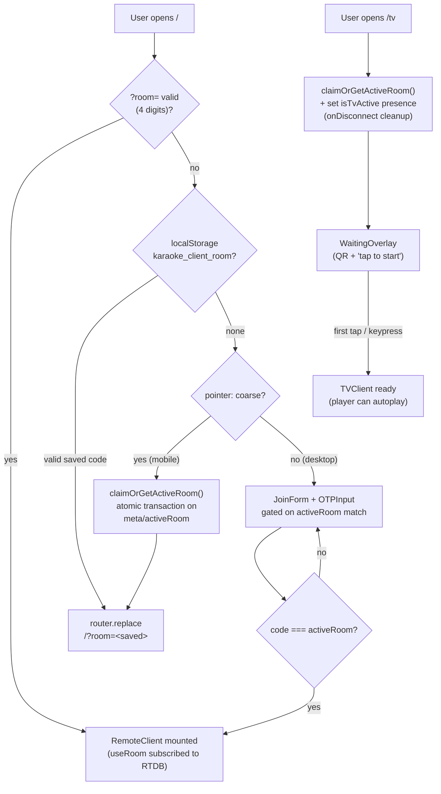
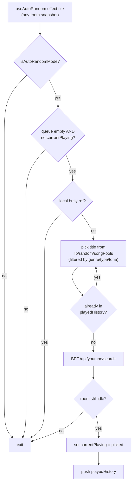

# BS Kara

A real-time karaoke app for parties. The TV runs the player; phones run the remote. Search YouTube, drop songs into a shared queue, hear an AI MC announce each track, and let auto-random keep the music going when nobody's queueing.

## Stack

- **Next.js 15** (App Router) + **React 19**
- **Firebase Realtime Database** — room state, queue, presence, MC lock
- **YouTube Data API v3** for search, **yt-search** scraper as the quota-exhausted fallback
- **OpenAI** (default) or **Gemini** for MC line generation
- **Google Cloud TTS** for MC voice playback
- **Tailwind CSS v4**, **react-i18next** (en + vi)
- **Vitest** + **Testing Library** + **MSW**, **Playwright** (chromium + firefox + webkit)

## Getting started

Prereqs: Node 20+, a Firebase project (with Realtime Database enabled), a YouTube Data API key, plus OpenAI/Gemini and Google TTS keys for the AI MC.

```bash
npm install
# create .env.local — see "Environment" in CLAUDE.md for the full key list
npm run dev
```

Open http://localhost:3000 on your phone (or simulate `pointer: coarse`) and http://localhost:3000/tv on a second screen.

Full env-var matrix and architecture notes: [CLAUDE.md](./CLAUDE.md).

---

## Architecture at a glance



The TV and the phones are both clients of the same Firebase room. Anything in `RoomState` (queue, currentPlaying, history, isPlaying, settings, MC lock, presence) syncs in both directions; everything else (search results, MC line generation, TTS audio) goes through a Next.js BFF route on the server.

---

## Room join flow



The active-room pointer at `meta/activeRoom` is a single Firebase node. The TV claims it on mount; mobile phones auto-attach; desktops type the code shown on the TV. The server only accepts a code that matches the pointer — random codes are rejected, so guests can't accidentally land in an empty room.

---

## Add-to-queue flow

```mermaid
sequenceDiagram
  autonumber
  participant Phone
  participant RTDB as Firebase RTDB
  participant BFF as /api/youtube/search
  participant MCGen as /api/generate-mc
  participant TV

  Phone->>BFF: GET ?q=<query>
  BFF-->>Phone: YouTubeVideo[]
  Phone->>Phone: Open RequesterDialog<br/>(if requesterPromptEnabled)
  Phone->>RTDB: push rooms/<id>/queue/<key><br/>= { ...video, requesterName? }
  RTDB-->>TV: snapshot (queue updated)
  RTDB-->>Phone: snapshot (queue updated;<br/>button flips to "Added")

  par MC line pre-generation (parallel)
    Phone->>MCGen: POST { songTitle, singerName }
    MCGen-->>Phone: { text }
    Phone->>RTDB: runTransaction queue/<key>.mcText = text<br/>(or currentPlaying if already promoted)
  end
```

The MC line is fetched in parallel and written back via a transaction — if the song promoted to `currentPlaying` before the LLM responded (typical when the queue was empty), the write follows it there instead of resurrecting the deleted queue node. Pre-generation is opportunistic; failures fall through to a static MC line at playback time.

---

## Playback + AI MC announcement

```mermaid
sequenceDiagram
  autonumber
  participant TV
  participant RTDB as Firebase RTDB
  participant Phone as Phone (fullscreen player)
  participant TTS as /api/tts
  participant Player as YouTube iframe

  RTDB-->>TV: currentPlaying changed (id = X)
  RTDB-->>Phone: currentPlaying changed (id = X)

  par Cross-device announcement race
    TV->>RTDB: runTransaction lastAnnouncedSongId<br/>claim "X" iff current !== "X"
    Phone->>RTDB: runTransaction lastAnnouncedSongId<br/>claim "X" iff current !== "X"
  end

  alt Winner (e.g. TV)
    TV->>TV: useMCPlayer gates iframe<br/>(mute + pause)
    TV->>TTS: POST { text, voice }
    TTS-->>TV: audio bytes
    TV->>TV: speak via useAIVoice
    TV->>TV: useMCKickPlay → setIsPlaying(true)
  else Loser (e.g. Phone)
    Phone->>Phone: tryClaimAnnouncementLock<br/>returns false
    Phone->>Phone: skip MC; video plays normally
  end

  Player->>RTDB: onSongEnd → playNext()
  RTDB-->>TV: queue[0] promoted to currentPlaying<br/>(or auto-random fills the slot)
```

Only one device speaks per song, even if both the TV and a phone fullscreen player are open. The lock at `lastAnnouncedSongId` survives reconnects, so a refresh of the announcing device doesn't double up.

---

## Auto-random flow



Both TV and phones can run the picker. The local busy ref dedupes within a single client; the post-fetch "still idle?" check dedupes across clients — whichever client writes `currentPlaying` first wins, and any other client that was about to write sees a non-empty slot and bails.

---

## Project layout

```
app/                 Next.js routes (page.tsx → RemoteClient, tv/page.tsx → TVClient,
                     api/* route handlers)
features/remote/     phone-side feature: RemoteClient + components/ + hooks/
features/tv/         TV-side feature:    TVClient    + components/ + hooks/
hooks/               shared hooks (useRoom — folder split by concern, useAutoRandom,
                     useMCPlayer, useMCKickPlay, useTransientNotice, useAIVoice, …)
components/          cross-feature presentational components (VideoPlayer,
                     EmojiLayer, ConfirmDialog, MCAnnouncementOverlay, …)
lib/                 firebase, activeRoom pointer, random/, text/, youtube/
locales/             en + vi i18n bundles (react-i18next)
e2e/                 Playwright specs
tests/               Vitest setup + MSW handlers
```

---

## Scripts

| Script | Purpose |
|---|---|
| `npm run dev` | Next dev server on `:3000` |
| `npm run build` | Production build |
| `npm run start` | Serve production build |
| `npm run lint` | ESLint (Next + TS rules) |
| `npm run test` | Vitest, one-shot |
| `npm run test:watch` | Vitest, watch mode |
| `npm run test:coverage` | Vitest + v8 coverage |
| `npm run test:e2e` | Playwright (chromium + firefox + webkit) |
| `npm run test:e2e:ui` | Playwright UI mode |
| `npx tsc --noEmit` | Typecheck (no dedicated script) |

---

## Contributing

Read [CLAUDE.md](./CLAUDE.md) — it has the full env-var matrix, the data-flow writeup, the component map, and the testing policy this repo enforces (regression tests for bug fixes, meaningful coverage for new code, the verification gates that must pass before a change is "done").
