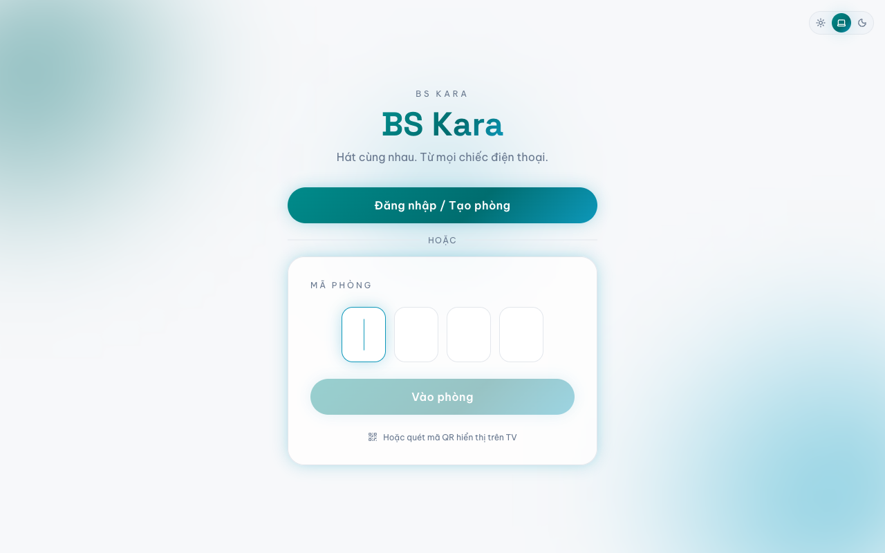
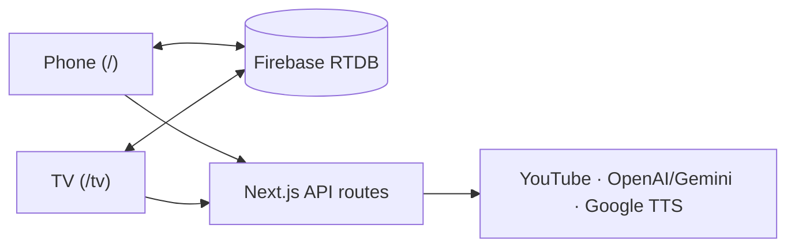

# BS Kara

Real-time karaoke for parties: the TV plays the songs, and everyone's phone is the remote.

**Live:** https://kara.bahuynh.com



## Features

- Search YouTube and add songs to a shared queue from any phone
- AI MC announces each song (OpenAI or Gemini text, Google TTS voice)
- Auto-random keeps music playing when the queue is empty (genre/tone filters)
- Voice chat to request songs by speaking
- Rooms per registered host, joined by code or QR; admin area for subscriptions and stats
- Vietnamese and English, light and dark theme

## Stack

| Part | Tech |
|---|---|
| Web | Next.js 16, React 19, Tailwind CSS v4 |
| Mobile | Expo (React Native) |
| Data | Firebase Realtime Database + Auth |
| APIs | YouTube Data API v3, OpenAI / Gemini, Google Cloud TTS |
| Tests | Vitest, Testing Library, MSW |
| Hosting | AWS EC2 (Terraform), Docker, Caddy, GitHub Actions |

## How it works


```mermaid
flowchart LR
  Phone["Phone (/)"] <--> RTDB[(Firebase RTDB)]
  TV["TV (/tv)"] <--> RTDB
  Phone --> API["Next.js API routes"]
  TV --> API
  API --> Ext["YouTube · OpenAI/Gemini · Google TTS"]
```

TV and phones share one room in Firebase, so the queue and playback stay in sync live. Search, MC lines
and voice go through the app's server so API keys never reach the browser.
Details: [docs/architecture.md](docs/architecture.md).

## Run locally

Needs Node 22, pnpm 10, a Firebase project with Realtime Database, and the API keys listed in
[CLAUDE.md → Environment](./CLAUDE.md#environment).

```bash
pnpm install
# create apps/web/.env.local with the keys from CLAUDE.md
pnpm dev    # http://localhost:3000 (remote) and /tv (TV screen)
```

To test on real phones, run a tunnel (`ngrok http 3000`) and set
`NEXT_PUBLIC_PUBLIC_ORIGIN=https://<tunnel-url>` in `.env.local` so the TV's QR code points to it.

| Command | What it does |
|---|---|
| `pnpm dev` / `pnpm dev:mobile` | Web / Expo dev server |
| `pnpm build` | Production build |
| `pnpm test` · `pnpm lint` · `pnpm typecheck` | Checks, all workspaces |

## Deploy

Every push to `main` that touches the web app is tested, built into a Docker image, and deployed to
AWS by GitHub Actions in about 2.5 minutes, with under a second of downtime.

- Setup log, step by step: [docs/devops/phase1-aws.md](docs/devops/phase1-aws.md)
- Day-to-day operations (health, rollback, costs): [docs/devops/runbook.md](docs/devops/runbook.md)

## Project layout

```
apps/web/          Next.js app: TV, remote, admin, API routes
apps/mobile/       Expo app
packages/shared/   Shared by web and mobile: Firebase, room hooks, i18n
infra/             Terraform, server setup, deploy scripts
docs/              Architecture, DevOps notes, specs
```

Contributing: read [CLAUDE.md](./CLAUDE.md) for the code map and testing rules.
