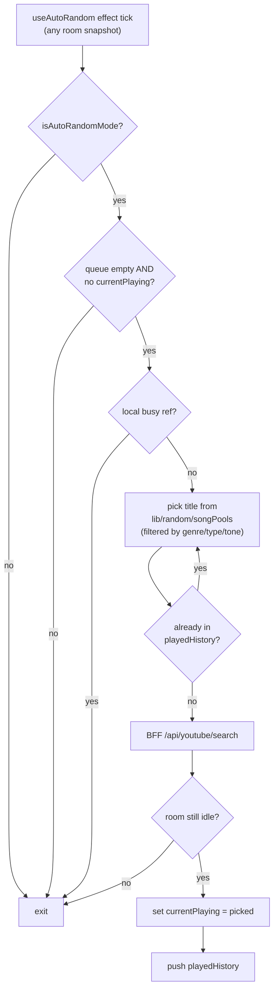

# Architecture

How the pieces talk to each other. Setup and scripts are in the [README](../README.md);
the code map is in [CLAUDE.md](../CLAUDE.md).

## Joining a room

- Each registered host has a fixed room code. The TV opens it by code or phone number (or `?room=` in the URL).
- Phones join with that code, a QR code on the TV, or a `/?room=<code>` link.
- Every way in goes through one check, `useRoomAccess` → `/api/room-access`. The room must exist, and the owner
  must have a subscription where `startDate <= now < endDate`. A refused room shows a blocked screen instead.

## Add-to-queue flow

```mermaid
sequenceDiagram
  autonumber
  participant Phone
  participant RTDB as Firebase RTDB
  participant BFF as /api/youtube/search
  participant MCGen as /api/generate-mc
  participant TV

  Phone->>BFF: GET ?q=<query>
  BFF-->>Phone: YouTubeVideo[]
  Phone->>Phone: Open RequesterDialog<br/>(if requesterPromptEnabled)
  Phone->>RTDB: push rooms/<id>/queue/<key><br/>= { ...video, requesterName? }
  RTDB-->>TV: snapshot (queue updated)
  RTDB-->>Phone: snapshot (queue updated;<br/>button flips to "Added")

  par MC line pre-generation (parallel)
    Phone->>MCGen: POST { songTitle, singerName }
    MCGen-->>Phone: { text }
    Phone->>RTDB: runTransaction queue/<key>.mcText = text<br/>(or currentPlaying if already promoted)
  end
```

The MC line is fetched in parallel and written back via a transaction — if the song promoted to `currentPlaying` before the LLM responded (typical when the queue was empty), the write follows it there instead of resurrecting the deleted queue node. Pre-generation is opportunistic; failures fall through to a static MC line at playback time.

## Playback + AI MC announcement

```mermaid
sequenceDiagram
  autonumber
  participant TV
  participant RTDB as Firebase RTDB
  participant Phone as Phone (fullscreen player)
  participant TTS as /api/tts
  participant Player as YouTube iframe

  RTDB-->>TV: currentPlaying changed (id = X)
  RTDB-->>Phone: currentPlaying changed (id = X)

  par Cross-device announcement race
    TV->>RTDB: runTransaction lastAnnouncedSongId<br/>claim "X" iff current !== "X"
    Phone->>RTDB: runTransaction lastAnnouncedSongId<br/>claim "X" iff current !== "X"
  end

  alt Winner (e.g. TV)
    TV->>TV: useMCPlayer gates iframe<br/>(mute + pause)
    TV->>TTS: POST { text, voice }
    TTS-->>TV: audio bytes
    TV->>TV: speak via useAIVoice
    TV->>TV: useMCKickPlay → setIsPlaying(true)
  else Loser (e.g. Phone)
    Phone->>Phone: tryClaimAnnouncementLock<br/>returns false
    Phone->>Phone: skip MC; video plays normally
  end

  Player->>RTDB: onSongEnd → playNext()
  RTDB-->>TV: queue[0] promoted to currentPlaying<br/>(or auto-random fills the slot)
```

Only one device speaks per song, even if both the TV and a phone fullscreen player are open. The lock at `lastAnnouncedSongId` survives reconnects, so a refresh of the announcing device doesn't double up.

## Auto-random flow



Both TV and phones can run the picker. The local busy ref dedupes within a single client; the post-fetch "still idle?" check dedupes across clients — whichever client writes `currentPlaying` first wins, and any other client that was about to write sees a non-empty slot and bails.
